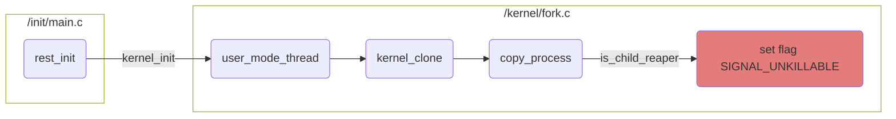

# Docker and PID 1

Exploring how non-init processes run and terminate (or not) inside docker container running as PID 1.

## Understanding how Linux protects process with PID 1

When the Linux kernel boots it starts one process in userland called init that will always get PID 1. The job of this init process is to:

- start other processes
- be the ancestor (direct or indirect) of all processes
- adopt orphaned processes
- terminate all processes on shutdown

PID 1 is protected in Linux:

- It will never receive any signal if this process didn't explicitly create a handle for this signal. For example, if you send `SIGTERM` to PID 1 process that didn't create a handle for this signal, the OS will not send this signal and never terminate the process by default.
- It will never receive `SIGKILL` or `SIGSTOP` unless it comes from the ancestor namespace.

So this means that you can't terminate or kill process with PID 1 like any other process.

### Looking under the hood

At the time of writing, the latest stable version of Linux is 6.1, so we will examine the source code of this version.

Our focus is on understanding how the init process obtains the `SIGNAL_UNKILLABLE` flag, which determines which processes can ignore signals.

This describes how PID 1 in any namespace gets the `SIGNAL_UNKILLABLE` flag:

- Linux starts the init process in `/init/main.c` in the [rest_init](https://github.com/torvalds/linux/blob/v6.1/init/main.c#L683-L730) function.
- We are interested in [line 694](https://github.com/torvalds/linux/blob/v6.1/init/main.c#L694) which passes the `kernel_init` function, which starts the init process, as an argument to the function [user_mode_thread](https://github.com/torvalds/linux/blob/v6.1/kernel/fork.c#L2737-L2748) from `/kernel/fork.c` that starts a process in user mode.
- `user_mode_thread` in [line 2747](https://github.com/torvalds/linux/blob/v6.1/kernel/fork.c#L2747) invokes the [kernel_clone](https://github.com/torvalds/linux/blob/v6.1/kernel/fork.c#L2630-L2715) function.
- `kernel_clone` in [line 2671](https://github.com/torvalds/linux/blob/v6.1/kernel/fork.c#L2671) invokes the  [copy_process](https://github.com/torvalds/linux/blob/v6.1/kernel/fork.c#L1988-L2557) function.
- `copy_process` is a big function, but in [line 2443](https://github.com/torvalds/linux/blob/v6.1/kernel/fork.c#L2443) it sets the `SIGNAL_UNKILLABLE` flag for the process that passes the `is_child_reaper` check.
- [is_child_reaper](https://github.com/torvalds/linux/blob/v6.1/include/linux/pid.h#L165-L168) is a function in `include/linux/pid.h` that checks if the process has PID 1 in its own namespace.

Now that PID 1 has the `SIGNAL_UNKILLABLE` flag, let's see how signals behave when this flag is set. All functions are contained in one file `/kernel/signal.c`.

- We start with the [send_signal_locked](https://github.com/torvalds/linux/blob/v6.1/kernel/signal.c#L1220-L1254) function. It sets the bool `force` variable. We'll note that in [lines 1247-1251](https://github.com/torvalds/linux/blob/v6.1/kernel/signal.c#L1247-L1251), it sets `force` to true if the signal coming from the ancestor namespace. Then it calls the `__send_signal_locked` function.
- [__send_signal_locked](https://github.com/torvalds/linux/blob/v6.1/kernel/signal.c#L1079-L1194) function in [line 1090](https://github.com/torvalds/linux/blob/v6.1/kernel/signal.c#L1090) will not send the signal to the process if the `prepare_signal` function returns false.
- [prepare_signal](https://github.com/torvalds/linux/blob/v6.1/kernel/signal.c#L906-L971) function in [line 970](https://github.com/torvalds/linux/blob/v6.1/kernel/signal.c#L970) will return false if the `sig_ignored` function will return true.
- [sig_ignored](https://github.com/torvalds/linux/blob/v6.1/kernel/signal.c#L101-L120) will return true if the `sig_task_ignored` function will return true.
- [sig_task_ignored](https://github.com/torvalds/linux/blob/v6.1/kernel/signal.c#L79-L99) function in [lines 89-91](https://github.com/torvalds/linux/blob/v6.1/kernel/signal.c#L89-L91) will return true if three conditions are met:
  - `unlikely(t->signal->flags & SIGNAL_UNKILLABLE)` - if process has the `SIGNAL_UNKILLABLE` flag set.
  - `handler == SIG_DFL` - if the handler for a signal is the default handler, meaning the process didn't register a handler.
  - `!(force && sig_kernel_only(sig))` - if this expression is false
    - `force` variable set to false
    - `sig_kernel_only(sig)` signal should be not `SIGKILL` or `SIGSTOP`
    - So there are multiple outcomes:
      - The signal **is not** `SIGKILL` or `SIGSTOP`, so this check `sig_kernel_only(sig)` will return false, so the `force` variable is irrelevant. Since the whole expression will be false.
      - If the signal **is** `SIGKILL` or `SIGSTOP`, then `force` is relevant. If it is set to true, meaning that the signal coming from the ancestor namespace, the whole expression will be true and the signal will be sent. If it was false, meaning that the signal coming from the current namespace, the whole expression will be false and the signal will be ignored.

To summarize, signals sent to PID 1 will be ignored if:

- The process has the `SIGNAL_UNKILLABLE` flag set, which is the case for any process with PID 1.
- The process did not create a handler for the signal.
- The signal is `SIGKILL` or `SIGSTOP` and it's sent from the process's own namespace.

## How that relates to Docker

Docker runs processes in namespaces, and the first process created gets PID 1 in its own namespace. PID 1 is special in Linux. When the command `docker stop` is run, it will send `SIGTERM` to the PID 1 inside the container. So if the process doesn't have a handler for `SIGTERM`, it will not receive it. Docker will wait for 10 seconds and then send `SIGKILL`. Since that signal will be coming from the ancestor namespace, it will be sent to PID 1 inside the container, and it will be "violently" killed.

And even if the process handles `SIGTERM`, it could spawn children. The parent process should propagate `SIGTERM` to its children. So the process with PID 1 inside the container should take the role of the init process on top of its core functions.

Not every container should have some kind of init process. You could handle `SIGTERM` (or you don't mind your process of being killed with `SIGKILL`) and don't spawn any children. But you probably would want some kind of init process. For that, for example, you can use [tini](https://github.com/krallin/tini) and use `-g` argument with it to propagate `SIGTERM` to all processes inside the container.

## Running example scripts

There are some script that demonstrate different scenarios of running process in Docker. Execute `run.sh` with this arguments:

- `python_noterm_bare` - Running python script that don't handle `SIGTERM` not inside Docker, then terminating it. It should terminate without problem.
- `python_term_bare` - Running python script that handle `SIGTERM` not inside Docker, then terminating it. It should terminate without problem and also output the log message that it received `SIGTERM` signal.
- `python_noterm_docker_noinit` - Running python script that don't handle `SIGTERM` inside Docker without init process, then terminating it. It should fail to terminate, and will be killed after 10 seconds.
- `python_term_docker_noinit` - Running python script that handle `SIGTERM` inside Docker without init process, then terminating it. It should terminate without problem and also output the log message that it received `SIGTERM` signal.
- `python_noterm_docker_init` - Running python script that don't handle `SIGTERM` inside Docker with init process, then terminating it. It should terminate without problem.
- `python_term_docker_init` - Running python script that handle `SIGTERM` inside Docker with init process, then terminating it. It should terminate without problem and also output the log message that it received `SIGTERM` signal.
- `multi_python_docker_noinit` - Running multiple python scripts (processes) that handle `SIGTERM` inside Docker without init process, then terminating it. It should fail to terminate, and will be killed after 10 seconds.
- `multi_python_docker_init` - Running multiple python scripts (processes) that handle `SIGTERM` inside Docker with init process, then terminating it. It should terminate without problem and also each python process output the log message that it received `SIGTERM` signal.
